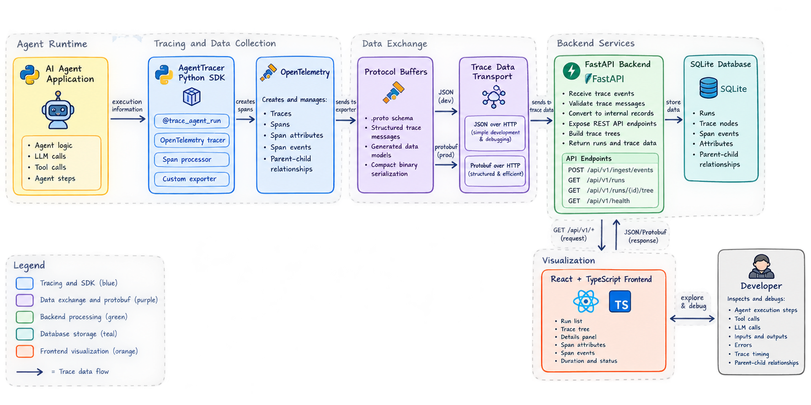

# AgentTracer

**Local step-by-step visual debugger for AI agents — trace your LLM runs, inspect spans, understand behavior.**

---

## Why AgentTracer?

AI agents are hard to debug. When your agent loops infinitely, returns unexpected results, or makes confusing tool calls, you need visibility into what happened — step by step.

Existing observability tools (Langfuse, LangSmith, etc.) are built for production monitoring: dashboards, metrics, team collaboration. They're heavy, require external services, and aren't optimized for the rapid iteration of local development.

**AgentTracer is different:**

- **Local-first** — SQLite database, no external services, works entirely offline
- **Developer-focused** — built for understanding your agent during development, not monitoring in prod
- **Step-by-step** — interactive tree view of every span, tool call, prompt, and response
- **Minimal setup** — start the backend, run your traced agent, open the UI
- **Python SDK** — OpenTelemetry-based decorators for agent runs and nested spans

If you've ever wished for a "debugger for agents" while developing an LLM app, AgentTracer is for you.

---

## Architecture



---

## Getting Started

### Prerequisites

- **Python 3.12+** (for backend) / **Python 3.10+** (for SDK)
- **Node.js 18+** (for frontend)
- **uv** (Python package manager) — install with `curl -LsSf https://astral.sh/uv/install.sh | sh`
- **npm** (comes with Node.js)

### 1. Start the Backend

```bash
cd AgentTracer/backend
uv sync
uv run uvicorn agent_tracer.main:app --port 8000
```

The backend starts on `http://localhost:8000`. API docs at `http://localhost:8000/docs`.

### 2. Trace Your Agent (SDK)

```bash
cd AgentTracer/sdk
uv sync
```

Create a Python script:

```python
from agent_trace_sdk import trace_agent_run

@trace_agent_run(name="my_agent")
def my_agent_function(user_input: str) -> str:
    # Your agent logic here
    result = f"Processed: {user_input}"
    return result

my_agent_function("What is the weather?")
```

Run it:

```bash
uv run python my_script.py
```

Traces are automatically sent to the backend.

### 3. View Traces in the UI

```bash
cd AgentTracer/frontend
npm install
npm run dev
```

Open `http://localhost:3000` in your browser. You'll see your traced runs in the sidebar. Click a run to explore the trace tree and inspect individual spans.

---

## SDK Usage

### Decorator (simplest)

```python
from agent_trace_sdk import trace_agent_run

@trace_agent_run(name="research_agent")
def research(query: str) -> str:
    return run_agent(query)

research("What is Python?")
```

### Nested Spans

Trace sub-steps, tool calls, and LLM calls inside an agent run — they become children of the active span automatically. Record inputs/outputs with the event helpers:

```python
from agent_trace_sdk import record_input, record_output, trace_agent_run, trace_span

@trace_agent_run(name="research_agent")
def research(query: str) -> str:
    record_input(query)

    @trace_span(name="search_web", span_type="tool_call")
    def search(q: str) -> str:
        return f"results for {q}"

    @trace_span(name="summarize", span_type="llm_call")
    def summarize(text: str) -> str:
        return f"summary of {text}"

    result = summarize(search(query))
    record_output(result)
    return result
```

### Console Exporter (offline debugging)

Don't want to start the backend? Swap in `ConsoleSpanExporter` — spans are printed to stdout instead of sent over HTTP:

```python
from agent_trace_sdk import ConsoleSpanExporter, init_tracing

init_tracing(exporter=ConsoleSpanExporter(mode="json"))  # or mode="pretty" (default)
```

### What Gets Collected

- **Spans** — each unit of work with start/end timestamps
- **Span types** — `agent_run`, `step`, `tool_call`, `llm_call`
- **Attributes** — key-value pairs you set on spans
- **Events** — custom events like `input`, `output`, `error`
- **Parent-child relationships** — nested spans form a tree
- **Reliable delivery** — failed exports are retained and retried
- **Offline debugging** — the console exporter can print spans without the backend

---

## API Endpoints

| Method | Path | Description |
|--------|------|-------------|
| `POST` | `/api/v1/ingest/events` | Accept trace events from SDK |
| `GET` | `/api/v1/runs` | List runs (paginated) |
| `GET` | `/api/v1/runs/{id}` | Get run details |
| `GET` | `/api/v1/runs/{id}/tree` | Get trace tree |
| `GET` | `/api/v1/health` | Health check |

---

## Project Structure

```
AgentTracer/
├── backend/             # FastAPI + SQLite (Python)
│   ├── pyproject.toml
│   └── src/agent_tracer/
│       ├── main.py      # FastAPI app factory and routes
│       ├── domain/       # Entities, interfaces, and tree builder
│       ├── application/  # Ingest and run services
│       └── infrastructure/ # Async SQLAlchemy and repositories
├── sdk/                 # Python tracing library
│   ├── pyproject.toml
│   └── src/agent_trace_sdk/
│       ├── setup.py           # OpenTelemetry setup and decorators
│       ├── exporter.py        # HTTP span exporter
│       ├── console_exporter.py # Offline console exporter
│       └── processor.py       # Retry batch processor
└── frontend/            # React + TypeScript UI
    ├── package.json
    ├── vite.config.ts
    └── src/
        ├── App.tsx
        └── components/  # RunList, TraceTree, DetailsPanel
```

---

## Roadmap / Future Work

- **Protocol Buffers transport** — structured trace messages between the SDK and backend
- **Configuration management** — environment-based database and application settings
- **Typed exception handling** — consistent validation and server error responses
- **Framework integrations** — LangChain, LlamaIndex, and OpenAI SDK wrappers
- **Enhanced visualization** — timeline view, filtering, and search
- **Run comparison** — side-by-side diff of two runs
- **Docker setup** — one-command startup with docker-compose
- **PostgreSQL backend** — for larger deployments

---

## License

This project is licensed under the MIT License.

## Documentation

- [OpenTelemetry Documentation](https://opentelemetry.io/docs/)
- [Protocol Buffers Documentation](https://protobuf.dev/)

---

**Built for developers who want to understand their AI agents, step by step.**